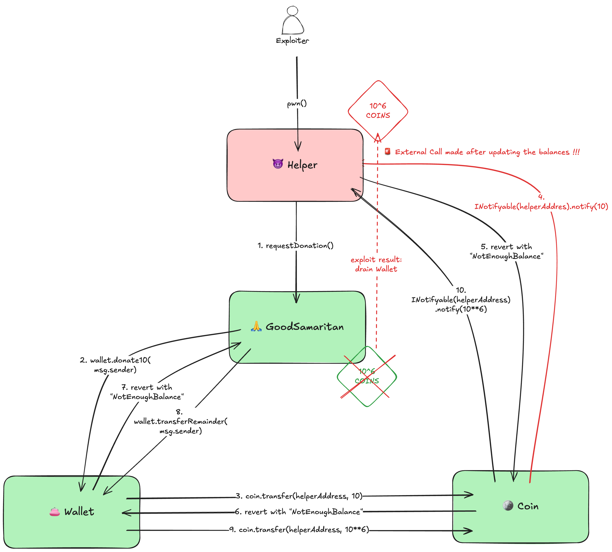

# [EthernautCTF](https://ethernaut.openzeppelin.com/)

| N°  | Contract                                                      | Done | Exploit PoC                                                                    | Description                                                                                                                                                                                                                                                                                                                     |
| --- | ------------------------------------------------------------- | :--: | ------------------------------------------------------------------------------ | ------------------------------------------------------------------------------------------------------------------------------------------------------------------------------------------------------------------------------------------------------------------------------------------------------------------------------- |
| 01  | [Fallback](../../src/EthernautCTF/Fallback.sol)               |  ✅  | [FallbackExploit](../../test/EthernautCTF/FallbackExploit.t.sol)               | Call a contract with some value to target the `receive` method.                                                                                                                                                                                                                                                                 |
| 02  | [Fallout](../../src/EthernautCTF/Fallout.sol)                 |  ✅  | [FalloutExploit](../../test/EthernautCTF/FalloutExploit.t.sol)                 | Typo in the constructor name.                                                                                                                                                                                                                                                                                                   |
| 03  | [CoinFlip](../../src/EthernautCTF/CoinFlip.sol)               |  ✅  | [CoinFlipExploit](../../test/EthernautCTF/CoinFlipExploit.t.sol)               | The contract relies on `block.number` to generate a random value.                                                                                                                                                                                                                                                               |
| 04  | [Telephone](../../src/EthernautCTF/Telephone.sol)             |  ✅  | [TelephoneExploit](../../test/EthernautCTF/TelephoneExploit.t.sol)             | Use a helper contract to make sure `tx.origin` and `msg.sender` are different.                                                                                                                                                                                                                                                  |
| 05  | [Token](../../src/EthernautCTF/Token.sol)                     |  ✅  | [TokenExploit](../../test/EthernautCTF/TokenExploit.t.sol)                     | Exploit overflows and underflows of the `0.6.0` solidity compiler.                                                                                                                                                                                                                                                              |
| 06  | [Delegation](../../src/EthernautCTF/Delegation.sol)           |  ❌  | [DelegationExploit](../../test/EthernautCTF/DelegationExploit.t.sol)           | Make use of the `delegatecall` to overwrite the storage of the main contract.                                                                                                                                                                                                                                                   |
| 07  | [Force](../../src/EthernautCTF/Force.sol)                     |  ✅  | [ForceExploit](../../test/EthernautCTF/ForceExploit.t.sol)                     | Create a contract, fund it with some ether and use the `selfdestruct` method to send the contract balance to any other contract (e.g. a contract without any implementation).                                                                                                                                                   |
| 08  | [Vault](../../src/EthernautCTF/Vault.sol)                     |  ✅  | [VaultExploit](../../test/EthernautCTF/VaultExploit.t.sol)                     | Read the password from the contract storage.                                                                                                                                                                                                                                                                                    |
| 09  | [King](../../src/EthernautCTF/King.sol)                       |  ✅  | [KingExploit](../../test/EthernautCTF/KingExploit.t.sol)                       | Implement a helper contract that reverts when receiving ether.                                                                                                                                                                                                                                                                  |
| 10  | [Reentrance](../../src/EthernautCTF/Reentrance.sol)           |  ✅  | [ReentranceExploit](../../test/EthernautCTF/ReentranceExploit.t.sol)           | Perform all state changes before making external calls to avoid re-entrancy exploits.                                                                                                                                                                                                                                           |
| 11  | [Elevator](../../src/EthernautCTF/Elevator.sol)               |  ✅  | [ElevatorExploit](../../test/EthernautCTF/ElevatorExploit.t.sol)               | When calling an external contract, always check the returned value before using it!                                                                                                                                                                                                                                             |
| 12  | [Privacy](../../src/EthernautCTF/Privacy.sol)                 |  ✅  | [PrivacyExploit](../../test/EthernautCTF/PrivacyExploit.t.sol)                 | Read the key from the contract storage                                                                                                                                                                                                                                                                                          |
| 13  | [GatekeeperOne](../../src/EthernautCTF/GatekeeperOne.sol)     |  ✅  | [GatekeeperOneExploit](../../test/EthernautCTF/GatekeeperOneExploit.t.sol)     | - Estimate the amount of gas a contract call would take using `gasleft` and binary search (dichotomy). - Another method is to use a `while` loop and to consume the gas tiny bits by tiny bits until the call succeeds. - Perform operations using bit masks.                                                             |
| 14  | [GatekeeperTwo](../../src/EthernautCTF/GatekeeperTwo.sol)     |  ✅  | [GatekeeperTwoExploit](../../test/EthernautCTF/GatekeeperTwoExploit.t.sol)     | - Create a contract that has a size equal to zero by putting all the logic inside the constructor. Indeed, a contract does not have source code available during construction. - Solidity does not support bitwise negation, but a simple way to perform the operation is to use the XOR operation (`^`) with `0xff` (ones). |
| 15  | [NaughtCoin](../../src/EthernautCTF/NaughtCoin.sol)           |  ✅  | [NaughtCoinExploit](../../test/EthernautCTF/NaughtCoinExploit.t.sol)           | Use the ERC20 `allowance` and `transferFrom` methods to send tokens on behalf of a nother address.                                                                                                                                                                                                                              |
| 16  | [Preservation](../../src/EthernautCTF/Preservation.sol) (\*)  |  ✅  | [PreservationExploit](../../test/EthernautCTF/PreservationExploit.t.sol)       | Make use of the `delegatecall` to overwrite the storage of the main contract. This time it involved a bit more creativity as it required to overwrite an address (20 bytes) using a uint256 (32 bytes).                                                                                                                         |
| 17  | [Recovery](../../src/EthernautCTF/Recovery.sol)               |  ✅  | [RecoveryExploit](../../test/EthernautCTF/RecoveryExploit.t.sol)               | The address of an Ethereum contract is deterministically computed from the address of its creator (sender) and its nonce (how many transactions the creator has sent). The sender and nonce are RLP-encoded and then hashed with keccak256. For a Solidity implementation, check the exploit code.                              |
| 18  | [MagicNumber](../../src/EthernautCTF/MagicNumber.sol)         |  ✅  | [MagicNumberExploit](../../test/EthernautCTF/MagicNumberExploit.t.sol)         | - Use raw bytecode to create the smallest possible contract. - Learn about initialization code to be able to run any runtime code. - Learn about `create` to create a contract from the initialization code.                                                                                                              |
| 19  | [AlienCode](../../src/EthernautCTF/AlienCodex.sol)            |  ✅  | [AlienCodeExploit](../../test/EthernautCTF/AlienCodexExploit.t.sol.txt)        | Take advantage of an array underflow vulnerability in the contract, to allow the attacker to manipulate the contract's storage.                                                                                                                                                                                                 |
| 20  | [Denial](../../src/EthernautCTF/Denial.sol)                   |  ✅  | [DenialExploit](../../test/EthernautCTF/DenialExploit.t.sol)                   | - Always set the amount of gas when using a low-level call. It will prevent the external contract to consume all the gas. - Check the return value of low-level calls, especially when the address is controlled by someone else.                                                                                            |
| 21  | [Shop](../../src/EthernautCTF/Shop.sol)                       |  ✅  | [ShopExploit](../../test/EthernautCTF/ShopExploit.t.sol)                       | - When calling an external contract, always check the returned value before using it! - This challenge is very similar to challenge 11.                                                                                                                                                                                      |
| 22  | [Dex](../../src/EthernautCTF/Dex.sol)                         |  ✅  | [DexExploit](../../test/EthernautCTF/DexExploit.t.sol)                         | The contract uses a division operation to compute the swap amount which can be exploited because of a precision loss. Indeed, Solidity does not support floating points.                                                                                                                                                        |
| 23  | [DexTwo](../../src/EthernautCTF/DexTwo.sol)                   |  ✅  | [DexTwoExploit](../../test/EthernautCTF/DexTwoExploit.t.sol)                   | The `swap` method does not check the addresses of the ERC20 tokens. This is a very bad practice since an exploiter can manipulate the balances of those tokens. Indeed, the swap amount is computed based on the token balances, so anyone can drain the tokens of the contract.                                                |
| 24  | [PuzzleWallet](../../src/EthernautCTF/PuzzleWallet.sol)       |  ✅  | [PuzzleWalletExploit](../../test/EthernautCTF/PuzzleWalletExploit.t.sol)       | When writing a Proxy contract, and more generally any contract that uses `delegatecall`, always make sure that the sensible storage values are not colliding with other values. The storage layout should be identical, for those values, on both the proxy and the implementation contracts.                                   |
| 25  | [Motorbike](../../src/EthernautCTF/Motorbike.sol)             |  ❌  |                                                                                |                                                                                                                                                                                                                                                                                                                                 |
| 26  | [DoubleEntry](../../src/EthernautCTF/DoubleEntry.sol)         |  ✅  | [DoubleEntryExploit](../../test/EthernautCTF/DoubleEntryExploit.t.sol)         | - When delegating calls from a deprecated token to another token (or any other contract), avoid sending new tokens in place of old tokens. - This level is made of a lot of different contracts, you can find an architecture diagram [below](#level-26).                                                                    |
| 27  | [GoodSamaritan](../../src/EthernautCTF/GoodSamaritan.sol)     |  ✅  | [GoodSamaritanExploit](../../test/EthernautCTF/GoodSamaritanExploit.t.sol)     | Making external calls after updating token balance is very dangerous...                                                                                                                                                                                                                                                         |
| 28  | [GatekeeperThree](../../src/EthernautCTF/GatekeeperThree.sol) |  ✅  | [GatekeeperThreeExploit](../../test/EthernautCTF/GatekeeperThreeExploit.t.sol) | - Make sure the `constructor` method is spelled properly. - Do not use `tx.origin` to check the origin of the caller. - Private variables are not private on a public blockchain. - It's easy to implement a contract that do not accepts ether.                                                                       |
| 29  | [Switch](../../src/EthernautCTF/Switch.sol)                   |  ❌  |                                                                                |                                                                                                                                                                                                                                                                                                                                 |
| 30  | [HigherOrder](../../src/EthernautCTF/HigherOrder.sol)         |  ✅  | [HigherOrderExploit](../../test/EthernautCTF/HigherOrderExploit.t.sol)         | Reading function parameters (or any other value) using `calldataload` is dangerous because it will always return a 32-byte value and not the expected type of the variable.                                                                                                                                                     |
| 31  | [Stake](../../src/EthernautCTF/Stake.sol)                     |  ✅  | [StakeExploit](../../test/EthernautCTF/StakeExploit.t.sol)                     | The contract updates the balance of the user before making sure the tokens have been transfered to the contract.                                                                                                                                                                                                                |

(\*) I opened a [PR](https://github.com/OpenZeppelin/ethernaut/pull/756) to prevent cheating in challenge 16.

## Architecture Diagrams

### Level 26

### Level 27

